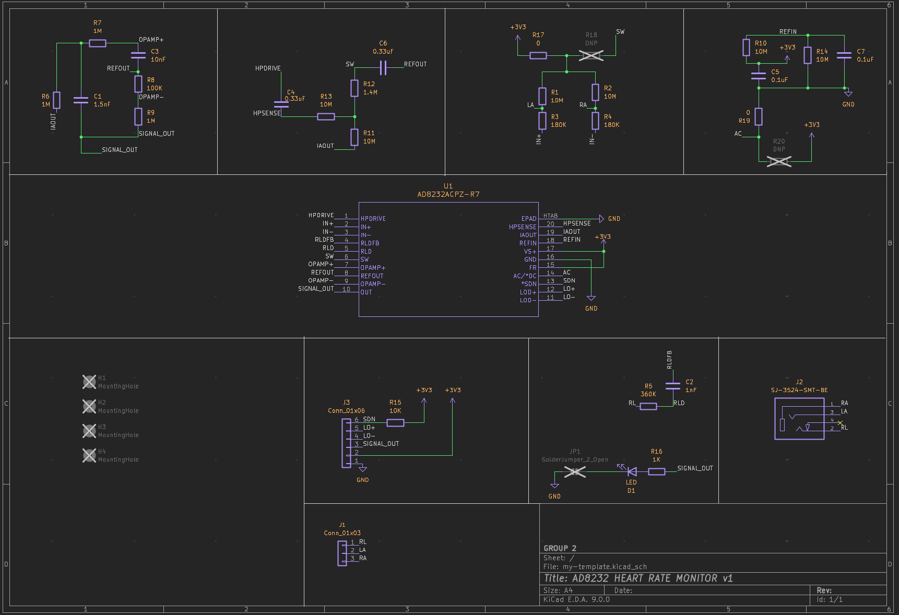
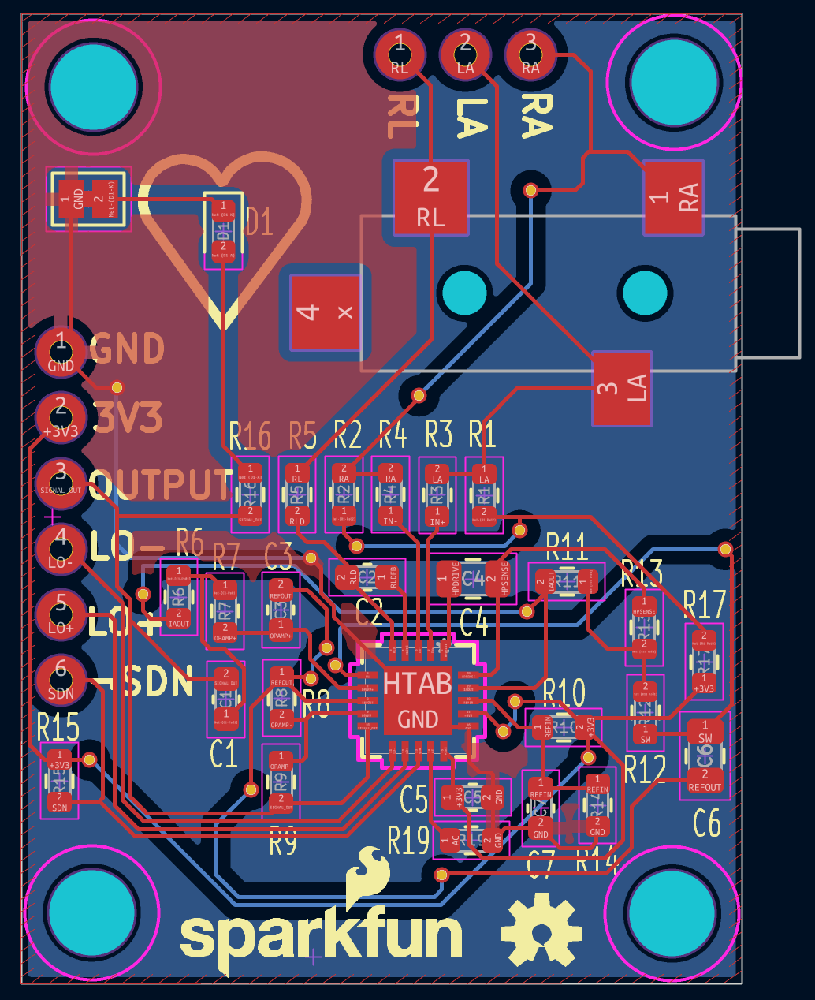
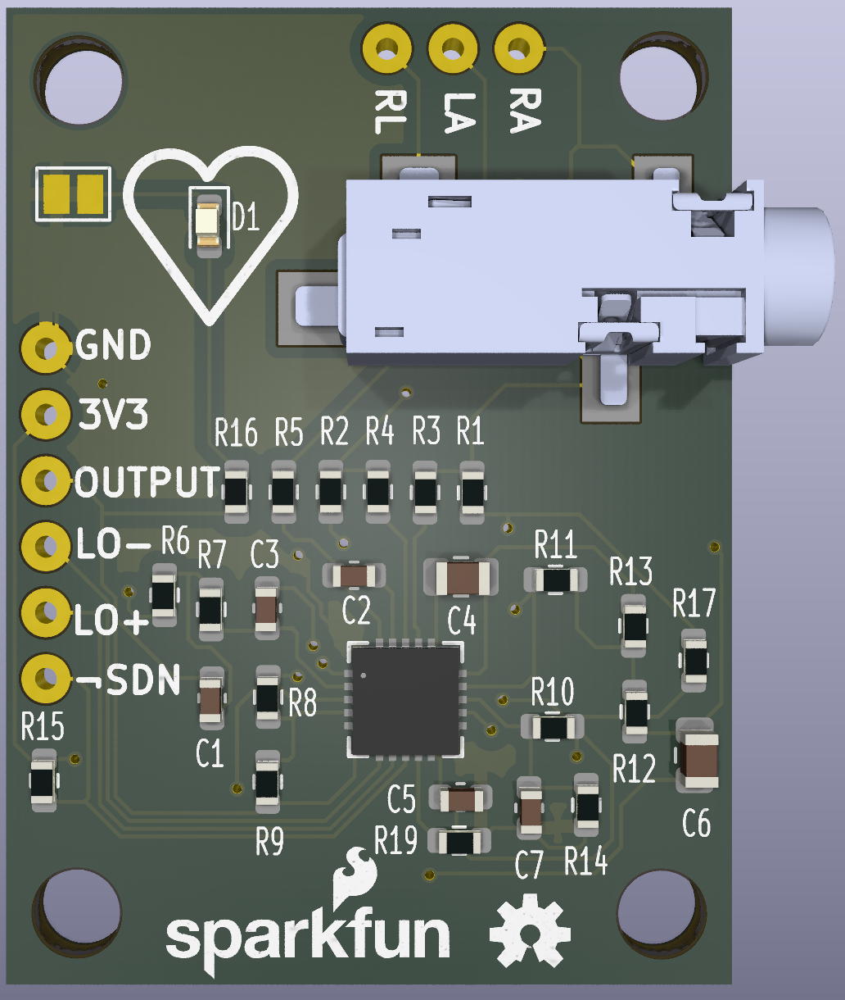

# AD8232-PCB-Design
KiCad v9 PCB design replicating the SparkFun AD8232 ECG module

## 1. Overview  
This project is a **replica** of the [SparkFun AD8232 ECG module](https://www.digikey.in/en/products/detail/sparkfun-electronics/SEN-12650/5824153) designed using **KiCad v9**. It includes the schematic, PCB layout, 3D rendering, Gerber files, and BOM.  

## 2. Project Files  
- **KiCad Project Files** → Includes the schematic, PCB layout, and component libraries.  
- **Gerber Files** → Generated using the **"Gerber to Order"** plugin for PCB fabrication.  
- **Bill of Materials (BOM)** → Created using the **"Interactive HTML BOM"** plugin, with Digikey part numbers and URLs.  
- **Project Documentation (PDF)** → Contains:  
  1. **Schematic Diagram**  
  2. **PCB Layout with Dimensions**  
  3. **3D Render of the Board**  
  4. **Bill of Materials (BOM)**  

## 3. Preview

### Schematic

### PCB Layout

### 3D View

